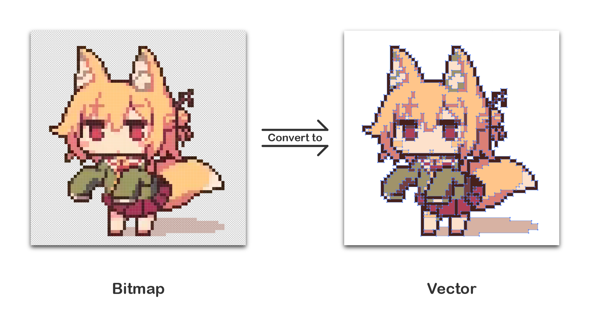

# pic2svg

## What can this program do?

This program can convert bitmaps to vector graphics, and keep pixel style.

Convert looks like this:



## How to build

*	MacOS:
	```
	brew install opencv@3
	brew link opencv@3 --force
	```

```
git clone https://github.com/YJBeetle/pic2svg.git
cd pic2svg
mkdir build
cd build
cmake -DCMAKE_BUILD_TYPE=RELEASE ../
make
```

## Run 
```
./pic2svg example/test.png -c 10
```
